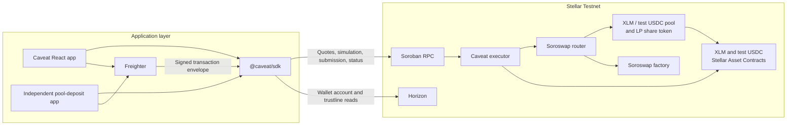

<div align="center">


<h1>Caveat</h1>

<p><strong>Guarded DeFi execution on Stellar.</strong></p>

<p>Wallet-funded swaps and liquidity contributions with signed spending limits,<br />minimum actual receipts, exact asset identities, and atomic settlement.</p>

<p>
  <a href="#getting-started">Getting started</a> ·
  <a href="./docs/ARCHITECTURE.md">Architecture</a> ·
  <a href="./packages/caveat-sdk/README.md">SDK reference</a> ·
  <a href="https://stellar.expert/explorer/testnet/contract/CCQMSZDYKY7TO6O65FEH663CISHHNWWUFY7N56GD2CWYGKETELXX554O">Testnet contract</a>
</p>

<p>
  
  
  
  
  
  <br />
  
  
  
  <a href="./LICENSE"></a>
</p>

</div>

---

## Contents

- [Overview](#overview)
- [System architecture](#system-architecture)
- [Contract reference](#contract-reference)
- [Execution guarantees](#execution-guarantees)
- [Getting started](#getting-started)
- [SDK integration](#sdk-integration)
- [Frontend behavior](#frontend-behavior)
- [Testnet deployment](#testnet-deployment)
- [Build and verification](#build-and-verification)
- [Ledger evidence](#ledger-evidence)
- [Repository structure](#repository-structure)
- [Build outputs](#build-outputs)
- [Troubleshooting](#troubleshooting)
- [Technical documentation](#technical-documentation)
- [License](#license)

## Overview

Caveat is a reusable Soroban execution guard and TypeScript integration SDK. A wallet authorizes an action together with its spending caps, minimum receipt, route, expiry, and nonce. The executor funds that action from the wallet, invokes the configured DeFi contracts, measures token balances, and settles the result back to the same wallet. A condition violation aborts the entire contract invocation.

The deployed integration uses the Soroswap XLM / test USDC pool on **Stellar Testnet**. The repository includes a React application for both supported actions and an independent TypeScript pool-deposit application built against the public SDK interface.

| Capability | Implementation |
| --- | --- |
| Exact-input swaps | XLM → test USDC and test USDC → XLM, with a maximum input spend and minimum actual output |
| Liquidity contributions | Separate XLM and test USDC spending caps, with a minimum actual pool-share receipt |
| Wallet funding | Action-specific token transfers authorized inside the execution invocation |
| Settlement | Outputs, pool shares, and unused action funding return to the signing wallet |
| Approval policy | Exact token-transfer authorization with `deny_approvals = true` |
| Replay control | Persistent nonce scoped to the owner address |
| Integration | ESM TypeScript SDK with typed policies, quotes, preparation, submission, and status |
| Wallet interface | Freighter signing, exact-issuer trustline setup, and pending-transaction recovery |

## System architecture



| Layer | Responsibility | Source |
| --- | --- | --- |
| Executor | Policy validation, constrained nested authorization, measured outcomes, settlement, nonce commitment | [`contracts/executor`](contracts/executor/src/lib.rs) |
| SDK | Decimal conversion, ABI encoding, deployment verification, public reads, quotes, simulation, transaction assembly and submission | [`packages/caveat-sdk`](packages/caveat-sdk/src/index.ts) |
| Main application | Intent forms, wallet connection, captured review, signing, receipts, recovery | [`src`](src/App.tsx) |
| Independent integration | Pool contribution flow using the SDK and Freighter | [`examples/pool-deposit`](examples/pool-deposit/src/main.ts) |
| Verification harnesses | Contract tests, browser tests, real-pool execution, adversarial fixtures, public evidence | [`tests`](tests), [`scripts`](scripts) |

### Transaction lifecycle

1. **Quote:** read the configured route and live pool state; calculate an estimated receipt and an initial minimum.
2. **Prepare:** verify contract bytecode and configuration, read the wallet nonce, encode the policy, simulate the invocation, and assemble the transaction.
3. **Authorize:** present the captured terms, exact identities, unsigned XDR, and assembled maximum fee; sign the transaction through Freighter.
4. **Execute:** validate owner authorization, policy bounds, route, expiry, and nonce; fund the action; authorize the precise nested transfers into the pool.
5. **Measure:** compare actual token or share balances against the signed conditions, then transfer proceeds and refunds to the owner.
6. **Commit:** check final wallet deltas and preserved executor baselines, advance the owner nonce, and emit the measured outcome.
7. **Confirm:** read the ledger transaction result and display the returned outcome. A submitted hash remains pending until a ledger result resolves it.

Soroban atomicity couples wallet funding, venue execution, settlement, and nonce changes. Network fees are accounted for at the transaction layer separately from the contract's token spending checks.

## Contract reference

The executor is compiled from [`contracts/executor/src/lib.rs`](contracts/executor/src/lib.rs). Its configuration binds one router, one pair, and two exact underlying token contract addresses at construction.

### Entrypoints

| Entrypoint | Arguments | Return |
| --- | --- | --- |
| `__constructor` | `Config` | Initializes immutable route configuration |
| `config` | — | `Config` |
| `nonce` | `owner: Address` | `u64` |
| `swap` | `SwapPolicy` | `Outcome` |
| `add_liquidity` | `LiquidityPolicy` | `Outcome` |

`Config` contains `router`, `pair`, `token_a`, and `token_b`, all typed as Soroban `Address` values.

### Shared signed fields

| Field | Type | Meaning |
| --- | --- | --- |
| `owner` | `Address` | Authorizing wallet and settlement recipient |
| `router` | `Address` | Router matching the executor configuration |
| `pair` | `Address` | Pool matching the executor configuration and router resolution |
| `expires_at` | `u64` | Unix timestamp; later than the current ledger time and at most one hour ahead |
| `nonce` | `u64` | Current persistent nonce for this owner |
| `deny_approvals` | `bool` | Required to be `true` |

### Swap policy

| Field | Type | Constraint |
| --- | --- | --- |
| `token_in`, `token_out` | `Address` | Either ordering of the configured token pair |
| `amount_in` | `i128` | Positive exact input amount |
| `max_spend` | `i128` | At least `amount_in`; bounds the final wallet input-token debit |
| `min_receive` | `i128` | Positive minimum final wallet output-token credit |

The SDK sets `max_spend` to `amount_in`. Swap receipts report input-token spending in `spent_a`, zero in `spent_b`, and output-token receipt in `received`.

### Liquidity policy

| Field | Type | Constraint |
| --- | --- | --- |
| `token_a`, `token_b` | `Address` | Exact configured token ordering |
| `max_a`, `max_b` | `i128` | Positive maximum wallet debit for each underlying token |
| `min_shares` | `i128` | Positive minimum wallet credit of pair-token shares |

The executor reads reserve ordering and computes funding at the current pool ratio within both signed caps. It checks newly received pool shares and transfers them to the owner. Liquidity receipts report both underlying-token debits and the actual share credit.

### ABI, storage, and events

- Policies are canonically sorted, **symbol-keyed** Soroban maps. Addresses, `i128` amounts, `u64` timestamps/nonces, and booleans use their corresponding `ScVal` types.
- XLM, test USDC, and the pinned pool shares use seven decimal places. The SDK accepts decimal strings and uses integer arithmetic for conversion and policy construction.
- `Config` is held in instance storage. `Nonce(owner)` is held in persistent storage and defaults to zero for a new owner.
- Successful actions increment the owner nonce and publish topics `(executed, action, owner, nonce)` with an `Outcome` payload.
- Instance and committed nonce state extend their TTL using a 100,000-ledger threshold and 120,000-ledger extension.
- `Outcome` contains `spent_a: i128`, `spent_b: i128`, and `received: i128`.

### Contract errors

| Code | Error | Trigger |
| ---: | --- | --- |
| 1 | `InvalidPolicy` | Invalid positive bounds, approval flag, validity window, owner, or configuration |
| 2 | `Expired` | Expiry has passed at ledger execution time |
| 3 | `Replay` | Signed nonce differs from the owner's current nonce |
| 4 | `WrongTokens` | Policy token identities or pool ordering differ from the supported configuration |
| 5 | `WrongRoute` | Router, pair, or router-resolved pair differs from configuration |
| 7 | `SpendExceeded` | Final wallet debit exceeds a signed cap |
| 8 | `ReceiptTooLow` | Actual output or share credit falls below the signed minimum |
| 9 | `Arithmetic` | Checked integer arithmetic fails |
| 10 | `Settlement` | Funding or final executor balance differs from its required baseline |
| 11 | `EmptyPool` | Pool reserves prevent ratio-based liquidity funding |

Soroban host authorization errors reject missing wallet permissions and nested calls outside the exact authorized transfer tree.

## Execution guarantees

The signed policy and exact wallet-funding sub-invocations are bound through Soroban source-account authorization. The executor grants nested authorization for the specific `token.transfer(executor, pair, amount)` calls required by the action.

| Condition | Enforcement |
| --- | --- |
| Exact route and assets | Match signed addresses to immutable configuration and resolve the configured pair through the router |
| Spending caps | Measure final owner balance deltas for every input token |
| Minimum receipts | Measure actual token/share credits at the executor and at the owner |
| Approval restriction | Authorize only the exact transfer tree required by the action |
| Atomic failure | Revert funding, venue token movements, settlement, and nonce changes when execution fails |
| Baseline preservation | Return only action-specific balances; preserve pre-existing executor balances |
| Replay protection | Commit the next owner nonce only after final settlement checks |
| Reviewed transaction | Compare the signed envelope's transaction hash with the prepared envelope before submission |

### Security assumptions and operational scope

Execution guarantees apply to the supported actions invoked through the configured executor. They depend on Soroban authorization and atomicity, correct balance reporting by the pinned asset/share contracts, and wallet authorization under the owner's control.

The owner selects the spending caps, minimum receipt, and validity window. Market execution is bounded by those signed values. Network fees, asset-issuer controls, and position performance after a liquidity contribution are separate from invocation outcome checks.

The executor exposes a fixed policy API and immutable configuration. Funds intended for an action enter through the authorized funding sub-invocations. Direct token transfers create a preserved balance baseline; the executor's public API provides action settlement.

The [architecture and threat model](docs/ARCHITECTURE.md) describes the authorization boundary, adversarial behavior, and trust dependencies in detail.

## Getting started

### Requirements

| Requirement | Purpose |
| --- | --- |
| Node.js 24 and npm | Workspace installation, TypeScript builds, Vite, and Node test harnesses |
| Freighter browser extension | Wallet connection and Stellar Testnet transaction signing |
| Funded Stellar Testnet G-address | Action funding, network fees, and trustline reserve |
| Rust stable with `wasm32v1-none` | Contract tests and local WASM compilation |
| Linux or Ubuntu WSL | Contract verification script |
| Microsoft Edge | Browser suite's configured Playwright channel |

The commands below use PowerShell. On Linux and macOS, use `npm` in place of `npm.cmd`.

### Install and run

```powershell
git clone https://github.com/ELLA0VICTOR/caveat.git
cd caveat
npm.cmd ci
npm.cmd run dev
```

Open the Vite URL, normally `http://localhost:5173`. The development command builds the SDK and independent example, stages the example into the main application's public directory, checks available legacy contract artifacts, and starts Vite.

Public network endpoints and deployment pins are defined in [`packages/caveat-sdk/src/deployment.ts`](packages/caveat-sdk/src/deployment.ts). The default application uses this public configuration directly; wallet signatures are handled by Freighter.

### Configure the wallet

1. Install [Freighter](https://www.freighter.app/) and select **Stellar Testnet**.
2. Fund the wallet's public G-address with [Friendbot](https://friendbot.stellar.org/).
3. Connect the wallet in Caveat and open **Wallet setup**.
4. Select **Review test USDC setup** when prompted, review the exact issuer, and sign the trustline transaction.
5. Wait for ledger confirmation before preparing an action.

The trustline enables the wallet to receive USDC from issuer `GBBD47IF6LWK7P7MDEVSCWR7DPUWV3NY3DTQEVFL4NAT4AQH3ZLLFLA5`. It is a separate classic Stellar asset-setup transaction. Test USDC for swaps and liquidity is available through the configured Soroswap pool.

### Execute a swap

1. Select **Swap** and enter an input amount.
2. Review the live quote and automatic minimum, or enter a custom minimum.
3. Select **Prepare & review intent**.
4. Check the wallet, exact token identities, router, pair, spending cap, minimum receipt, expiry, nonce, and maximum network fee.
5. Sign the reviewed transaction in Freighter.
6. Wait for ledger confirmation and inspect the transaction receipt.

The middle arrow switches between XLM → USDC and USDC → XLM. The form updates token identities, units, quotes, and signing terms together.

### Provide liquidity

1. Hold both XLM and test USDC in the wallet.
2. Select **Provide liquidity** and enter the maximum XLM contribution.
3. Review the matched USDC cap and minimum pool shares.
4. Prepare, review, and sign the policy.
5. Confirm the share receipt and inspect the wallet's pool-share balance in **Wallet setup**.

Liquidity contributions use the existing pool's reserve ratio. Their signed conditions include both underlying-token caps and the minimum actual LP share credit.

### Independent integration application

```powershell
npm.cmd run example:dev
```

Open `http://127.0.0.1:5175`. This application imports `@caveat/sdk` and Freighter and implements its own quotes, setup, review, signing, and receipt flow. The main build also serves it at `/integrations/pool/index.html`.

### Earlier account recovery

**Wallet setup → Recover funds from an earlier account** exposes the retained owner-authorized withdrawal flow for `contracts/account` deployments. Enter or restore the account address, verify its owner and balances, and review the withdrawal transaction. USDC recovery requires the matching wallet trustline.

## SDK integration

`@caveat/sdk` is provided as an npm workspace at [`packages/caveat-sdk`](packages/caveat-sdk). It emits ESM JavaScript and TypeScript declarations:

```powershell
npm.cmd run sdk:build
```

Applications use the SDK to prepare guarded actions and supply their own wallet connection, review UI, and signing integration.

### Quote and prepare a swap

```ts
import { CaveatClient } from '@caveat/sdk'
import type { PreparedAction, SwapDirection } from '@caveat/sdk'

const client = new CaveatClient()

export async function prepareSwap(
  owner: string,
  amount: string,
  direction: SwapDirection = 'xlm-to-usdc',
): Promise<PreparedAction> {
  const quote = await client.quote('swap', amount, direction)

  return client.prepare(owner, 'swap', {
    amount,
    minimum: quote.minimum,
    minutes: 10,
    direction,
  })
}
```

Use `'usdc-to-xlm'` for the reverse direction. Amounts and minimums are decimal strings in the respective input and output assets. The default quoted minimum is 99% of the estimated output, rounded down in integer token units.

### Quote and prepare liquidity

```ts
export async function prepareLiquidity(
  owner: string,
  maximumXlm: string,
): Promise<PreparedAction> {
  const quote = await client.quote('liquidity', maximumXlm)
  if (!quote.maxB) throw new Error('Matched USDC amount unavailable.')

  return client.prepare(owner, 'liquidity', {
    amount: maximumXlm,
    maxB: quote.maxB,
    minimum: quote.minimum,
    minutes: 10,
  })
}
```

### Review, sign, and submit

Render the review from `prepared.terms`, `prepared.source`, `prepared.executor`, `prepared.nonce`, `prepared.expiresAt`, `prepared.fee`, and `prepared.xdr`, together with the exact route identities exported by the SDK. Invoke the signing function after the user approves those captured conditions.

```ts
import { Networks } from '@stellar/stellar-sdk'
import { getNetworkDetails, signTransaction } from '@stellar/freighter-api'

export async function signReviewedAction(prepared: PreparedAction) {
  const network = await getNetworkDetails()
  if (network.error || network.networkPassphrase !== Networks.TESTNET) {
    throw new Error('Select Stellar Testnet in Freighter.')
  }

  const signed = await signTransaction(prepared.xdr, {
    address: prepared.source,
    networkPassphrase: Networks.TESTNET,
  })
  if (signed.error || !signed.signedTxXdr) {
    throw new Error('Wallet signature unavailable.')
  }

  return client.submitSigned(prepared, signed.signedTxXdr, hash => {
    localStorage.setItem('caveat-integration-pending', hash)
  })
}
```

Persist the hash before awaiting confirmation. Handle `confirmed`, `failed`, and `pending` results explicitly. Use `client.status(hash)` to resolve a pending submission before preparing a replacement action. A confirmed receipt's `outcome` contains the measured ledger return. Convert its integer amounts with `fromUnits`.

### SDK API

| Method or export | Purpose |
| --- | --- |
| `new CaveatClient(executor?, expectedHash?)` | Initialize the client with the verified deployment defaults |
| `verifyRoute()` | Check router, factory, pool, bytecode pins, linkage, and underlying SAC identities |
| `verifyExecutor()` | Check executor bytecode/configuration and the supported route |
| `quote(action, amount, direction?)` | Return decimal-string estimates and automatic minimums; liquidity includes `maxB` |
| `wallet(owner)` | Read XLM, USDC, shares, owner nonce, and trustline authorization |
| `prepare(owner, action, terms)` | Verify, snapshot, encode, simulate, and assemble a guarded action |
| `prepareTrustline(owner)` | Assemble the exact test USDC classic trustline transaction |
| `submitSigned(prepared, signedXdr, onSubmitted?)` | Validate the signed body, submit, and poll for a ledger result |
| `status(hash)` | Resolve confirmed, failed, or pending transaction status |
| `toUnits`, `fromUnits` | Convert decimal strings and integer token units |
| `swapAssets(direction?)` | Resolve the exact pinned swap assets and display symbols |
| `encodePolicy`, `struct` | Construct typed, canonical Soroban policy values |
| `prepareOperation(owner, operation, seconds?)` | Assemble generic infrastructure operations used by the verification harnesses |
| `@caveat/sdk/deployment` | Lightweight deployment identifiers, bytecode pins, and direction helpers |

`prepare` is the SDK entrypoint for protected actions. The full [SDK reference](packages/caveat-sdk/README.md) covers signing requirements, preparation snapshots, and status handling.

## Frontend behavior

- Quotes refresh after a 400 ms typing pause. Request results are keyed to action, amount, and swap direction.
- Automatic minimums use 1% tolerance. Custom minimums remain attached to the amount and direction for which they were entered.
- Preparation is gated on a usable quote and valid terms. Quote failures clear previous automatic bounds.
- Reversing a ready swap carries the estimated output into the new input amount and clears the old minimum.
- Review uses a captured preparation snapshot. Quote refresh pauses during review and transaction work.
- Freighter permission, active address, and Testnet selection are checked during connection restoration.
- Pending action hashes survive refresh and require a status check before another preparation.
- Transaction status opens in a modal for wallet approval, submission, ledger confirmation, and the final result. Confirmed swaps and liquidity contributions display their measured wallet receipts.
- Pending actions are checked every five seconds after submission polling completes. Closing the modal preserves tracking; a resolved result reopens it. Pending swaps and USDC setup also restore their status modal after refresh.
- Asset icons identify displayed tokens; the signing policy and verification logic bind their contract addresses.
- Fonts and token icons are served from local assets. The interface uses Archivo, DM Sans, and DM Mono.

## Testnet deployment

The deployment constants are maintained in [`packages/caveat-sdk/src/deployment.ts`](packages/caveat-sdk/src/deployment.ts).

| Setting | Value |
| --- | --- |
| Network | Stellar Testnet |
| Network passphrase | `Test SDF Network ; September 2015` |
| Soroban RPC | `https://soroban-testnet.stellar.org` |
| Horizon | `https://horizon-testnet.stellar.org` |
| Executor | `CCQMSZDYKY7TO6O65FEH663CISHHNWWUFY7N56GD2CWYGKETELXX554O` |
| Native XLM SAC | `CDLZFC3SYJYDZT7K67VZ75HPJVIEUVNIXF47ZG2FB2RMQQVU2HHGCYSC` |
| Test USDC SAC | `CBIELTK6YBZJU5UP2WWQEUCYKLPU6AUNZ2BQ4WWFEIE3USCIHMXQDAMA` |
| Test USDC issuer | `GBBD47IF6LWK7P7MDEVSCWR7DPUWV3NY3DTQEVFL4NAT4AQH3ZLLFLA5` |
| Soroswap router | `CCJUD55AG6W5HAI5LRVNKAE5WDP5XGZBUDS5WNTIVDU7O264UZZE7BRD` |
| Soroswap factory | `CDP3HMUH6SMS3S7NPGNDJLULCOXXEPSHY4JKUKMBNQMATHDHWXRRJTBY` |
| Pool / LP share token | `CCBX3NZTCQLQFSPG7HBOKL4P2RVPOPVFHDNRTOSCCJWBTPL2GHEH7RQS` |

### Pinned bytecode

| Component | SHA-256 |
| --- | --- |
| Caveat executor | `6586b06fee1a0709dbc7638ea180bf89fc8973aaeaa0b1c7b2811126cb549c5d` |
| Soroswap router | `4b95bbf9caec2c6e00c786f53c5f392c2fcdb8435ac0a862ab5e0645eb65824c` |
| Soroswap factory | `86285a9234d3f0d687eaf88efe8d5d72172b38c9a86624c9934c0cbf2aff2993` |
| Soroswap pool | `8447525edd62f72ffaf52136358034657ea0511a8fec1cd0ebde649f86cca464` |

Preparation checks the executor hash, immutable configuration, route bytecode, router/factory pair linkage, and SAC identities. Archived or unavailable state requires restoration or deployment maintenance before execution.

## Build and verification

### Application and SDK

```powershell
npm.cmd run build
npm.cmd run lint
npm.cmd test
npm.cmd run test:ui
```

| Command | Operation |
| --- | --- |
| `npm.cmd run dev` | Build SDK/example, stage public assets, start the main Vite server |
| `npm.cmd run sdk:build` | Compile SDK ESM and declarations |
| `npm.cmd run example:dev` | Start the independent integration on port 5175 |
| `npm.cmd run example:build` | Build the independent integration |
| `npm.cmd run build` | Build SDK, example, and main application |
| `npm.cmd run preview` | Serve the main production build locally |
| `npm.cmd run lint` | Run Oxlint |
| `npm.cmd test` | Build SDK and run Node policy/transaction tests |
| `npm.cmd run test:ui` | Run Playwright with Microsoft Edge |
| `npm.cmd run contracts:stage` | Verify and stage the legacy account WASM when available |

The browser suite is configured for Edge and the Windows `npm.cmd` executable in [`playwright.config.ts`](playwright.config.ts). Quote and wallet fixtures exercise form and connection behavior. Controlled signing and ledger fixtures exercise transaction status presentation, pending recovery, and error handling. Contract execution evidence is generated by the live harnesses.

### Contract toolchain

On Linux or inside Ubuntu WSL, install Rust stable with the WebAssembly target, then run:

```sh
rustup update stable
rustup target add wasm32v1-none
bash scripts/verify-contracts.sh
```

Run the script from the repository root. It checks Rust formatting, executes locked host tests, builds all three release contracts, and emits SHA-256 checksums. Its default compilation cache is `/var/tmp/caveat-linux-verify/target`; override `CARGO_TARGET_DIR` to select another cache. Release artifacts are copied into `contracts/target/wasm32v1-none/release/`.

Keep `contracts/Cargo.lock` committed so host-test cryptography dependencies remain resolved to the compatible locked versions.

### Verification coverage

| Suite | Coverage |
| --- | --- |
| 9 executor host tests | Wallet funding, swaps, liquidity, actual receipts, reserve ordering, dual caps, baselines, policy binding, nonce/replay, authorization, and adversarial rollback |
| 12 account host tests | Retained account policy enforcement and recovery implementation |
| 10 Node tests | Decimal precision, canonical ABI encoding, token direction, deployment checks, and signed-body/expiry validation |
| 20 browser tests | Forms, layout, automatic quote races, custom minimums, reversal, wallet restoration, pending submissions, transaction status, recovery, dialogs, and independent integration |

The [verification record](docs/VERIFICATION.md) includes the artifact checksums, test boundaries, and public ledger reports. The [GitHub Actions workflow](.github/workflows/verify.yml) builds the contracts first, uploads their artifacts, then runs the application build, lint, and Node tests.

### Live Testnet harnesses

Build the contract artifacts before running the deployment and fixture harnesses.

```powershell
npm.cmd run test:executor:testnet
npm.cmd run test:reverse:testnet
npm.cmd run test:guard-attacks:testnet
```

| Harness | Operation |
| --- | --- |
| `test:executor:testnet` | Create a disposable Friendbot wallet, deploy and verify a shared executor, execute a real swap and liquidity contribution, and check settlement and minimum enforcement |
| `test:reverse:testnet` | Use the published executor, acquire test USDC, execute USDC → XLM, and compare actual wallet deltas, fees, guard balances, and nonce |
| `test:guard-attacks:testnet` | Deploy isolated executor instances against honest/lying/approval/extra-transfer swap fixtures and inspect rejection and rollback |
| `test:attack:testnet` | Exercise the retained account implementation against its historical adversarial fixtures |

The executor harness updates the SDK's public executor pin after successful verification. Rebuild clients after that change. To reuse the recorded deployment:

```powershell
npm.cmd run test:executor:testnet -- --reuse-deployment
```

Harnesses submit Testnet transactions, generate disposable signing identities in process memory, and write public reports to `docs/evidence/`. The guard attack harness separates a submitted underpayment failure from approval and extra-transfer cases rejected during actual RPC simulation.

### Production frontend build

```powershell
npm.cmd run build
npm.cmd run preview
```

Publish `dist/` to a static host to serve the application and the built integration example. Its deployed contract configuration remains Stellar Testnet. The root Vite configuration uses the origin root as its base path. Serve `/integrations/pool/index.html` as the example's own entrypoint.

## Ledger evidence

Public reports retain policies, measured balances, nonces, transaction hashes, ledger numbers, and diagnostic assertions.

| Operation | Measured result | Ledger transaction |
| --- | --- | --- |
| XLM → test USDC | 2 XLM spent; 0.2114439 USDC credited to the wallet | [5,054,833](https://stellar.expert/explorer/testnet/tx/766cd2f8f6cfcde8e43d1b62c7db740d443cfd4a3090cb18827616541703fa4a) |
| Liquidity contribution | 1 XLM + 0.10604 USDC spent; 0.3088669 shares credited to the wallet | [5,054,836](https://stellar.expert/explorer/testnet/tx/a7bc0267c2b394544db81e416fb6627290dd2f1631c8086a22f5768bc0df29a6) |
| Test USDC → XLM | 0.05 USDC spent; 0.4701154 XLM credited to the wallet, with network fee accounted separately | [5,055,346](https://stellar.expert/explorer/testnet/tx/2e139dad916534f9971554e1326b4061f2c63fb5c31978fe1c5de43cf4b0e875) |
| Honest isolated fixture | 1 XLM spent; 2 USDC credited to the wallet | [5,054,873](https://stellar.expert/explorer/testnet/tx/8c2c8878d22960a94d03dde9a7e0b4d5c78cd5591b9e18fd94938e9f35285572) |
| Underpaying isolated fixture | Contract error 8; wallet funding, venue token transfers, and nonce rolled back; transaction fee charged | [5,054,878](https://stellar.expert/explorer/testnet/tx/9817f4f2fedde27fbafb462d3868778e62ee4c1cc1b26e5e83f9d9f368765599) |

The first three rows execute against the configured Soroswap pool. The fixture rows use separately configured test venues with controlled rates and adversarial behavior.

- [Soroswap execution report](docs/evidence/testnet-executor.json)
- [Reverse swap report](docs/evidence/testnet-reverse-swap.json)
- [Executor adversarial report](docs/evidence/testnet-guard-attacks.json)
- [Retained account adversarial report](docs/evidence/testnet-attacks.json)

## Repository structure

Complete source and configuration tree, rooted at the repository checkout:

```text
caveat/
├── .github/
│   └── workflows/
│       └── verify.yml
├── contracts/
│   ├── account/
│   │   ├── src/
│   │   │   ├── lib.rs
│   │   │   └── test.rs
│   │   └── Cargo.toml
│   ├── demo-router/
│   │   ├── src/
│   │   │   └── lib.rs
│   │   └── Cargo.toml
│   ├── executor/
│   │   ├── src/
│   │   │   ├── lib.rs
│   │   │   └── test.rs
│   │   └── Cargo.toml
│   ├── Cargo.lock
│   └── Cargo.toml
├── docs/
│   ├── evidence/
│   │   ├── testnet-attacks.json
│   │   ├── testnet-executor.json
│   │   ├── testnet-guard-attacks.json
│   │   └── testnet-reverse-swap.json
│   ├── ARCHITECTURE.md
│   ├── DEMO.md
│   ├── EXECUTOR.md
│   ├── TESTNET.md
│   └── VERIFICATION.md
├── examples/
│   └── pool-deposit/
│       ├── src/
│       │   ├── main.ts
│       │   └── style.css
│       ├── index.html
│       ├── package.json
│       ├── README.md
│       ├── tsconfig.json
│       └── vite.config.ts
├── packages/
│   └── caveat-sdk/
│       ├── src/
│       │   ├── deployment.ts
│       │   └── index.ts
│       ├── package.json
│       ├── README.md
│       └── tsconfig.json
├── public/
│   ├── fonts/
│   │   ├── archivo-LICENSE.txt
│   │   ├── archivo.ttf
│   │   ├── dm-mono-LICENSE.txt
│   │   ├── dm-mono.ttf
│   │   ├── dm-sans-LICENSE.txt
│   │   └── dm-sans.ttf
│   ├── caveat.svg
│   ├── favicon.svg
│   └── icons.svg
├── scripts/
│   ├── stage-contracts.mjs
│   ├── stage-integration.mjs
│   ├── testnet-attacks.mjs
│   ├── testnet-executor.mjs
│   ├── testnet-guard-attacks.mjs
│   ├── testnet-reverse-swap.mjs
│   └── verify-contracts.sh
├── src/
│   ├── assets/
│   │   ├── tokens/
│   │   │   ├── NOTICE.md
│   │   │   ├── usdc.svg
│   │   │   └── xlm.svg
│   │   ├── hero.png
│   │   ├── react.svg
│   │   └── vite.svg
│   ├── components/
│   │   ├── BoundaryArt.tsx
│   │   ├── Brand.tsx
│   │   ├── Dialog.tsx
│   │   ├── IntentSlip.tsx
│   │   ├── TestnetSetup.tsx
│   │   ├── TransactionStatus.tsx
│   │   └── WalletSetup.tsx
│   ├── hooks/
│   │   ├── useCaveat.ts
│   │   └── useLiveQuote.ts
│   ├── lib/
│   │   ├── contracts.ts
│   │   ├── executor.ts
│   │   ├── policy.ts
│   │   ├── stellar.ts
│   │   ├── testnet.ts
│   │   ├── tokens.ts
│   │   └── transaction.ts
│   ├── App.css
│   ├── App.tsx
│   ├── index.css
│   └── main.tsx
├── tests/
│   ├── ui/
│   │   ├── integration.spec.ts
│   │   ├── quotes.spec.ts
│   │   ├── transactions.spec.ts
│   │   ├── wallet.spec.ts
│   │   └── workspace.spec.ts
│   ├── executor.test.ts
│   ├── policy.test.ts
│   └── stellar.test.ts
├── .gitattributes
├── .gitignore
├── .oxlintrc.json
├── index.html
├── LICENSE
├── package-lock.json
├── package.json
├── playwright.config.ts
├── README.md
├── tsconfig.app.json
├── tsconfig.json
├── tsconfig.node.json
└── vite.config.ts
```

### Source responsibilities

| Path | Responsibility |
| --- | --- |
| `src/hooks/useCaveat.ts` | Action state, wallet restoration, review/signing, submission recovery, receipts, and legacy recovery settings |
| `src/hooks/useLiveQuote.ts` | Debouncing, stale-response cancellation, timeout, and automatic minimum lifecycle |
| `src/components/IntentSlip.tsx` | Swap/liquidity forms, direction reversal, token identities, and policy inputs |
| `src/components/WalletSetup.tsx` | Live wallet balances, USDC trustline setup, and executor inspection |
| `src/components/TransactionStatus.tsx` | Wallet, submission, confirmation, error, and measured receipt presentation |
| `src/components/TestnetSetup.tsx` | Earlier account recovery |
| `src/lib/executor.ts` | Main-app adapter to the SDK |
| `src/lib/stellar.ts` | Freighter integration and retained transaction/read helpers |
| `src/lib/testnet.ts` | Earlier account inspection, deployment, and recovery operations |
| `src/lib/contracts.ts` | Earlier account release pins |
| `src/lib/policy.ts` | Earlier account policy utilities |
| `src/lib/tokens.ts` | Address-keyed token metadata and local logo mapping |
| `src/lib/transaction.ts` | Transaction phases, kinds, amount summaries, and status headings |
| `contracts/demo-router` | Controlled adversarial swap fixture |
| `scripts/stage-integration.mjs` | Copy the independent example build into the main public assets |
| `scripts/stage-contracts.mjs` | Check and stage the legacy account WASM |
| `scripts/verify-contracts.sh` | Formatting, locked host tests, release builds, and checksums |

## Build outputs

Generated artifacts and local credential paths are covered by [`.gitignore`](.gitignore). Source configuration and package lockfiles remain versioned.

| Output path | Contents |
| --- | --- |
| `packages/caveat-sdk/dist/` | SDK ESM modules and TypeScript declarations |
| `examples/pool-deposit/dist/` | Independent integration production assets |
| `public/integrations/pool/` | Staged independent example served by the main application |
| `contracts/target/wasm32v1-none/release/` | Three contract WASM binaries and `SHA256SUMS` |
| `public/contracts/` | Staged legacy account WASM |
| `dist/` | Main application and included integration assets |
| `test-results/`, `playwright-report/` | Browser test artifacts |

Public network identifiers belong in the SDK deployment module. Wallet authorization belongs in Freighter. Local `.env`, credential directories, and key files are ignored by the repository's secret-file rules.

## Troubleshooting

| Symptom | Resolution |
| --- | --- |
| Freighter connection or signing fails | Unlock the extension, confirm site access, and select Stellar Testnet |
| Test USDC setup is required | Review and confirm the exact-issuer trustline in Wallet setup |
| Quote fails | Check network access, pool availability, deployment pins, and token amount precision |
| `Error(Value, UnexpectedType)` | Check symbol-keyed policy maps and exact ABI field types |
| `ReceiptTooLow` / contract error 8 | Re-quote and review the signed minimum against the current pool outcome |
| `Replay` / contract error 3 | Resolve pending transactions, refresh the owner nonce, and prepare again |
| Additional wallet authorization is requested | Use the owner as the transaction source; the current SDK assembles source-account authorization |
| Transaction remains pending | Check the persisted hash through RPC status before another action |
| Contract state is archived or pins differ | Restore or verify the deployment state, then update verified configuration and rebuild clients |
| Integration link opens the main application | Use the explicit `/integrations/pool/index.html` entrypoint |
| Contract artifacts are unavailable | Run the Linux/WSL contract verification script to generate release WASM |

## Technical documentation

| Document | Contents |
| --- | --- |
| [Architecture and threat model](docs/ARCHITECTURE.md) | Invocation flow, policy authorization, settlement, and trust dependencies |
| [Executor design](docs/EXECUTOR.md) | Wallet funding, constrained nested transfers, balance checks, and storage |
| [SDK reference](packages/caveat-sdk/README.md) | Client API, preparation, wallet integration, and receipt handling |
| [Testnet setup](docs/TESTNET.md) | Wallet configuration, deployment, WSL toolchain, and recovery |
| [Verification record](docs/VERIFICATION.md) | Artifact pins, host/browser checks, and ledger evidence |
| [Integration example](examples/pool-deposit/README.md) | Independent application setup and supported flow |
| [Execution walkthrough](docs/DEMO.md) | Live swaps, liquidity contributions, and rejection demonstrations |

## License

Caveat's original source code is distributed under the [MIT License](LICENSE).

Bundled fonts retain their license notices in [`public/fonts`](public/fonts). Token icons retain their [asset notice](src/assets/tokens/NOTICE.md). Third-party dependencies retain their respective licenses.
