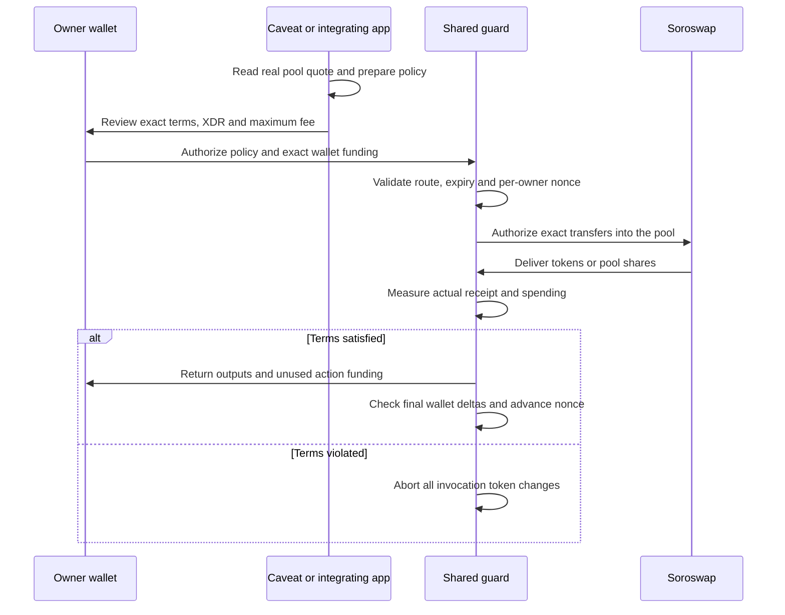

# Caveat architecture and threat model

## Product boundary

The current product is a **shared wallet-funded executor**, not a general SEP smart wallet or a browser-wide transaction interceptor. Two immutable Soroswap endpoints are supported: `swap` and `add_liquidity`. A G-address wallet authorizes its entire policy and exact funding sub-invocations through source-account authorization. There is no off-chain signature scheme or relayer.

Another app can import `@caveat/sdk` and call the same executor. Our separate pool-deposit app demonstrates that integration without importing the Caveat UI. Apps that bypass the executor receive no Caveat protection. A DEX's existing minimum-output parameter is useful; Caveat's claim is a reusable constrained execution boundary, actual settlement checks and liquidity share receipts, not the invention of swap slippage protection.

The published instance fixes router, pair and both underlying token addresses at construction. No administrator, upgrade, withdrawal, arbitrary-call or allowance endpoint exists. Client provenance checks pin its bytecode and configuration, Soroswap router/factory/pair bytecode, factory linkage and exact SAC identities. The contract checks its immutable route for every caller; clients cannot weaken that configuration.

## Architecture

## Signed conditions

Both policies bind owner/recipient, router, pair, exact token identities, expiry, persistent per-owner nonce and mandatory `deny_approvals=true`.

Swap additionally binds exact input amount, maximum spend and minimum output. Liquidity binds maximum XLM, maximum test USDC and minimum pair-token shares. Validity is at most one hour. Owner authorization occurs before policy validation, binding every field and the entrypoint. Each funding transfer also needs the wallet's exact child authorization.

Structs are encoded as canonically sorted symbol-keyed maps with typed addresses, i128 amounts and u64 nonce/expiry. String keys do not match the Soroban ABI. Review displays captured preparation terms, independent of later quote changes.

## Execution and settlement

1. Require the owner signature; validate expiry, nonce, positive bounds, exact tokens and immutable router/pair. Confirm `router_pair_for`.
2. Snapshot wallet and executor balances. For swaps, pull only the exact input. For liquidity, calculate the pool ratio within both signed caps and pull those exact amounts.
3. Authorize only the exact underlying-token transfers from executor to pinned pair. A direct router authorization request is satisfied by its contract invoker. No approvals, transfer-from calls or excess transfers are authorized.
4. Call the real Soroswap ABI with the executor as recipient. Ignore the router's claimed return values. The swap router minimum is deliberately zero; the guard checks the signed output itself.
5. Require the actual output or LP-share increase to meet the signed minimum. Refund unused action inputs and transfer the result to the same wallet.
6. Check final wallet spend and receipt deltas. Preserve all executor balances that existed before this invocation. Advance that owner's nonce and publish measured outcome only on success.

Violation aborts the full Soroban invocation, including the wallet funding step. Network fees are charged outside that invocation and outside spending limits. Input and output deltas mean net settlement, not gross trading volume. Preexisting donations are never a later user's funding; direct deposits are unsupported and have no recovery API.

Persistent nonces and instance TTLs are extended on use. Archived state must be restored; the SDK reports restoration requirements rather than fabricating a fresh nonce or successful execution.

Liquidity requires an existing pool with positive reserves. Estimated shares use reserves and supply; pool changes and fee-on dilution may reduce the result and cause rejection. Shares represent a pool position. The guard does not promise later position value or protect impermanent loss. Liquidity removal is outside this release.

## Threat model

| Threat | Boundary |
| --- | --- |
| Venue lies about its returned amount | Actual token/share balances decide success |
| Venue delivers too little | Invocation aborts; funding, settlement and nonce roll back |
| Venue requests an approval or extra transfer | Exact nested authorization rejects it |
| Changed signed field, owner, token, venue or entrypoint | Owner authorization and immutable route validation reject it |
| Replay or expired action | Per-owner nonce and capped expiry reject it |
| Another caller tries to spend executor donations | Exact transfers and baseline-preserving settlement reject it |
| Weak minimum voluntarily signed | Allowed; no fair-price oracle |
| Dishonest underlying or LP token balances | Outside assumptions; only pinned implementations are supported |
| Compromised key/frontend tricking the owner into weak terms | Outside protection; full transaction review remains necessary |
| Issuer freeze/clawback or later pool losses | Outside this action's checks |
| Other Freighter transactions | Unprotected unless explicitly routed through the guard |
| Failed transaction fee or denial of service | Not rolled back; no availability guarantee |

## Client behavior and evidence

Quotes are genuine public RPC reads with an unfunded placeholder source, never submitted. Automatic minimums use 1% tolerance. Late quotes are discarded by action/amount key; failure clears automatic bounds and blocks preparation. Quotes pause during transaction work and review.

Preparation verifies provenance and source authorization, then performs genuine simulation. Only confirmed ledger success creates a successful execution receipt. Unknown submissions remain pending, survive reload and block another preparation until checked. Keys stay in Freighter; the SDK accepts signed XDR, not secret keys. The separate app uses the same public SDK and actual executor.

The USDC trustline is a one-time classic asset permission to receive that exact issuer. It grants no Caveat spending allowance. Funds stay in the wallet between actions. The earlier account remains immutable and owner-recoverable; its saved address is retained for withdrawal only.

The swap form also offers three labelled test contracts: underpayment, forbidden approval, and extra transfer. Each check verifies the fixture hash, mode, isolated guard hash, immutable configuration, route resolution, and underlying assets before a fresh public RPC simulation. Isolated guards run the same executor bytecode as the Soroswap guard. The normal SDK route remains pinned to Soroswap.

The UI reports **Blocked by Caveat** only when diagnostics prove the selected rejection: guard error 8 with an actual underlying-token transfer below the minimum, or the exact forbidden token call with an authorization error. Unrelated failures remain interruptions. Weak minimums that satisfy the simulated settlement are displayed as **Conditions satisfied**. These checks request no signature, submit no transaction, and create no ledger receipt. Fixture claims use declared artificial rates, separately labelled from live Soroswap quotes.

See [verification](VERIFICATION.md) for real Soroswap swap/liquidity receipts and an isolated malicious venue's submitted rollback.

## Primary references

- [Soroswap router ABI and implementation](https://github.com/soroswap/core/blob/main/contracts/router/src/lib.rs)
- [Soroswap pair and share accounting](https://github.com/soroswap/core/blob/main/contracts/pair/src/lib.rs)
- [Stellar contract transactions and authorization](https://developers.stellar.org/docs/learn/fundamentals/contract-development/contract-interactions/stellar-transaction)
- [Stellar token interface](https://developers.stellar.org/docs/tokens/token-interface)

The SDK has explicit Testnet and Mainnet profiles with separate router, factory, pool and asset pins. Switching networks discards in-flight quotes and unsigned review state; pending operations remain scoped to their originating network. Mainnet guard creation uses the same tested executor artifact and verifies the confirmed instance before selection. Malicious fixtures and earlier account recovery remain Testnet operations. See [Mainnet integration](MAINNET.md) for deployment and fee details.

Independent security review is pending for the Mainnet pilot. Additional protocols, liquidity removal, wallet-native policy review and general account authentication remain future work.
